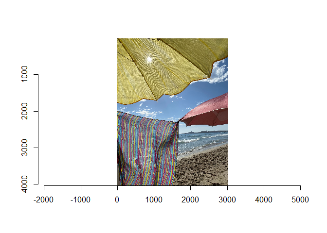
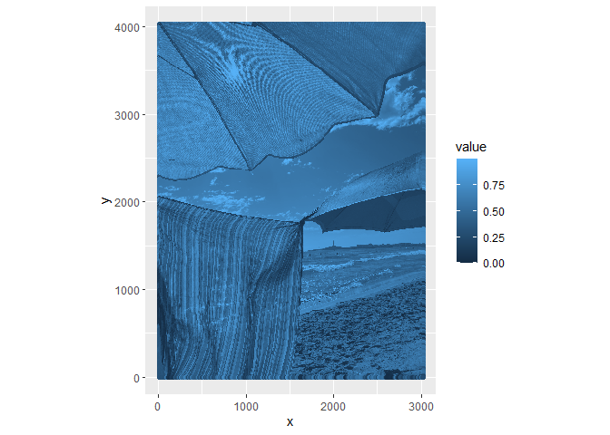
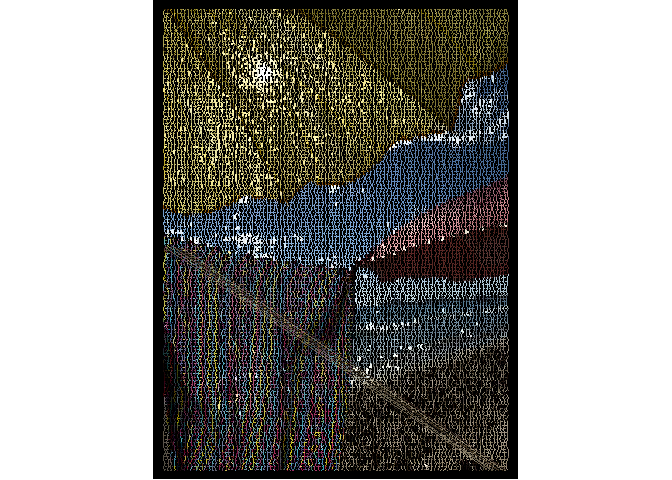

<!-- README.md is generated from README.Rmd. Please edit that file -->

# cross-stitched-images

<!-- badges: start -->
<!-- badges: end -->

In this notebook I read an image and then create a plot with the aspect
of woven art.

The following packages are used:

``` r
library(dplyr) # For data carpentry
library(glue) # Glue strings of data
library(ggplot2) # Elegant plots
library(imager) # Working with images
library(purrr) # Functional programming
library(tidyr) # Tidying data
```

First, read the image using `imager::load.image()`:

``` r
# Name of the image
im_name <- "umbrella-2"
# Read named image
im <- load.image(glue::glue(here::here(), "/source-images/{im_name}.jpg"))
```

Display the image information:

``` r
im
#> Image. Width: 3024 pix Height: 4032 pix Depth: 1 Colour channels: 3
```

Plot the image. Some of the images are courtesy of my talented cousin
[Dolores Robles
Martinez](https://www.instagram.com/doloresrobles_m/?hl=en):

``` r
plot(im)
```

<!-- -->

Convert the image to grayscale and then to a dataframe, store grayscale
values:

``` r
im_df <- im %>%
  grayscale() %>% 
  as.data.frame() %>%
  # Reverse the y axis; conventionally, images index the pixel starting from the top-left corner of the image
  mutate(y = -(y - max(y)))
```

Convert image to a data frame again and now retrieve the strings with
the hexadecimal color names:

``` r
color_df <- im %>%
  as.data.frame(wide="c") %>% 
  # Reverse the y axis; retrieve the color channels and save as strings with the hexadecimal name of the colors
  mutate(y = -(y - max(y)),
         hex_color = rgb(c.1,
                         c.2,
                         c.3))
```

Bind the hexadecimal colors to the data frame with the image:

``` r
im_df$hex_color <- color_df$hex_color
```

Plot the image using the data frame and grayscale values:

``` r
ggplot() + 
  geom_point(data = im_df %>%
               filter(x %% 10 == 0, y %% 10 == 0),
             aes(x,
                 y,
                 color = value)) + 
  coord_equal()
```

<!-- -->

This next chunk is a data frame for plotting paths for the vertical
“stitches” of the pattern. The “gap” is the space between stitches. A
small gap produces a tighter stitched pattern, and a larger gap produces
a looser woven pattern. A gap of 1 simply replicates the image:

``` r
# Select a gap
gap <- 30
stitch <- expand.grid(x = seq(1, max(im_df$x), gap), y = seq(1, max(im_df$y), gap))
```

Add noise. Notice that the spacing between threads is the “gap” so you
probably want to use an amount of noise that does not deviate more than
about half of that (with a gap of 10 I use plus/minus 3 horizontal
deviations):

``` r
stitch <- stitch %>%
  mutate(dx = runif(n(), -gap/3, gap/3),
         dx = x + dx)
```

Join the colors of the image to the vertical stitched paths:

``` r
stitch <- stitch %>%
  left_join(im_df,
            by = c("x", "y"))
```

In this chunk I define a function to create the horizontal “stitches” or
“threads”. This is probably the trickiest part of the algorithm, because
I want the horizontal paths to alternately “cross” one of the horizontal
threads:

``` r
# This function creates a cross-stitching pattern. The length of the segments is xend - xstart. The "width" is the horizontal width of the image. The stitches are positioned at "y" on the vertical axis. The default values are for stitches 10 units long, in a thread that is 100 units long, and positioned at y = 1 
cstitch <- function(y = 1, width = 100, xstart = 1, xend = 11){
  # Number of segments calculated based on the width of the image and the length of the stitches
  segs <- round(width/(2 *(xend - xstart)))
  # Create a data frame that repeats the starting and ending points of the segments in x and the y coordinate
  data.frame(x = rep(c(xstart, 
                       xend),
                     segs),
             y = y) %>%
    # Mutate the data frame to "shift" the stitches horizontally
    mutate(s = rep(1:(n()/2), each = 2),
           x = x + width/segs * (s - 1))
}
```

Create alternating cross-stitches:

``` r


# Spacing in y is every twice the gap, starting at 1
y <- seq(1, 
         max(stitch$y), 
         2 * gap)

# Use the function cstitch and purrr::pmap_dfr to obtain a data frame with the pattern. Each stitch is xend - xstart long, and they are positioned at the values in the sequence defined by y above; notice that the first stitch begins at x = 3 
cstitch_1 <- purrr::pmap_dfr(list(y), 
                             ~cstitch(.x, 
                                      width = max(stitch$x), 
                                      xstart = 3, 
                                      xend = 17), 
                             .id = "id") %>%
  # Mutate the id for the groups to avoid ambiguities uniquely identifying each stitch, for example id = 1 and s = 11 is confused with id = 11 and s = 1. Modifying the identifier avoids this
  mutate(group = paste0("1",
                        id, 
                        "0", 
                        s))

# Now the spacing in y is twice the gap + 1
y <- seq(gap + 1, 
         max(stitch$y),
         2 * gap)

# Use the function cstitch and purrr::pmap_dfr to obtain a data frame with the pattern. Each stitch is xend - xstart long, and they are positioned at the values in the sequence defined by y above; notice that the first stitch begins at x = 13...this will alternate the stitches relative to the previous data frame
cstitch_2 <- pmap_dfr(list(y), 
                      ~cstitch(.x, 
                               width = max(stitch$x),
                               xstart = 13,
                               xend = 27), 
                      .id = "id") %>%
  # Mutate the id for the groups to avoid ambiguities uniquely identifying each stitch, for example id = 1 and s = 11 is confused with id = 11 and s = 1 by adding codes this is avoided
  mutate(group = paste0("1", 
                        # Add the last identifier in the first pattern to give unique identifiers
                        as.numeric(id) + max(as.numeric(cstitch_1$id)),
                        "0",
                        s))
```

Join the colors to the horizontal stitches:

``` r
# First bind the alternating horizontal stitches into a single data frame
cstitch_1 <- rbind(cstitch_1,
                   cstitch_2) %>%
  # The values in x are not integers, so we round to then match to the colors in the image
  mutate(xr = round(x),
         # Add a small amount of vertical noise; remember 
         dy = runif(n(), -3, 3),
         dy = y + dy) %>%
  left_join(im_df,
            by = c("xr" = "x", "y"))
```

Use ggplot to render the image:

``` r
  # The data frame with the "stitches" or "threads" is simply coordinates. Plot as paths; remember to drop all NAs that might have resulted near the edges of the image (due to a stitch starting/ending beyond the borders of the image)

ggplot() +
  # First the vertical "stitches" or "threads"
  geom_path(data = stitch %>% drop_na(),
            # The aesthetics are the x coordinate with the small random shift and the y coordinates; each thread is grouped by the original x coordinate; use the hexadecimal colors, and use the grayscale value to change the size of the paths 
            aes(x = dx,
                y = y,
                group = x,
                color = hex_color,
                size = value)) + 
  # Now the horizontal "stitches" or "threads"
  geom_path(data = cstitch_1 %>% drop_na(),
            # The aesthetics are the x coordinate and the y coordinates with the small random shift; each thread is a group identified uniquely by "group" in the data frame; use the hexadecimal colors, and use the grayscale value to change the size of the paths 
            aes(x,
                dy,
                group = group,
                color = hex_color,
                size = value)) +
  # IMPORTANT: The colors are given by the names of colors in hexadecimal; use `scale_color_identity`
  scale_color_identity() +
  # Defne the range of sizes for the paths
  scale_size(range = c(0.1, 0.75)) +
  coord_equal(expand = FALSE) +
  # theme_void() does not use grid lines, background, ticks, or any of the other items typically used in statistical plots
  theme_void() +
  # Modify other theme elements (i.e., no legend, margins, background)
  theme(legend.position = "none",
        plot.margin = margin(0.1, 0.1, 0.1, 0.1, "in"),
        panel.background = element_rect(color = NA,
                                        fill = "black"),
        plot.background = element_rect(color = NA,
                                       fill = "black"))
```

<!-- -->

``` r

# Save named image
ggsave(glue::glue(here::here(), "/output/{im_name}-woven.png"),
       height = 7,
       width = 7,
       units = "in")
```
